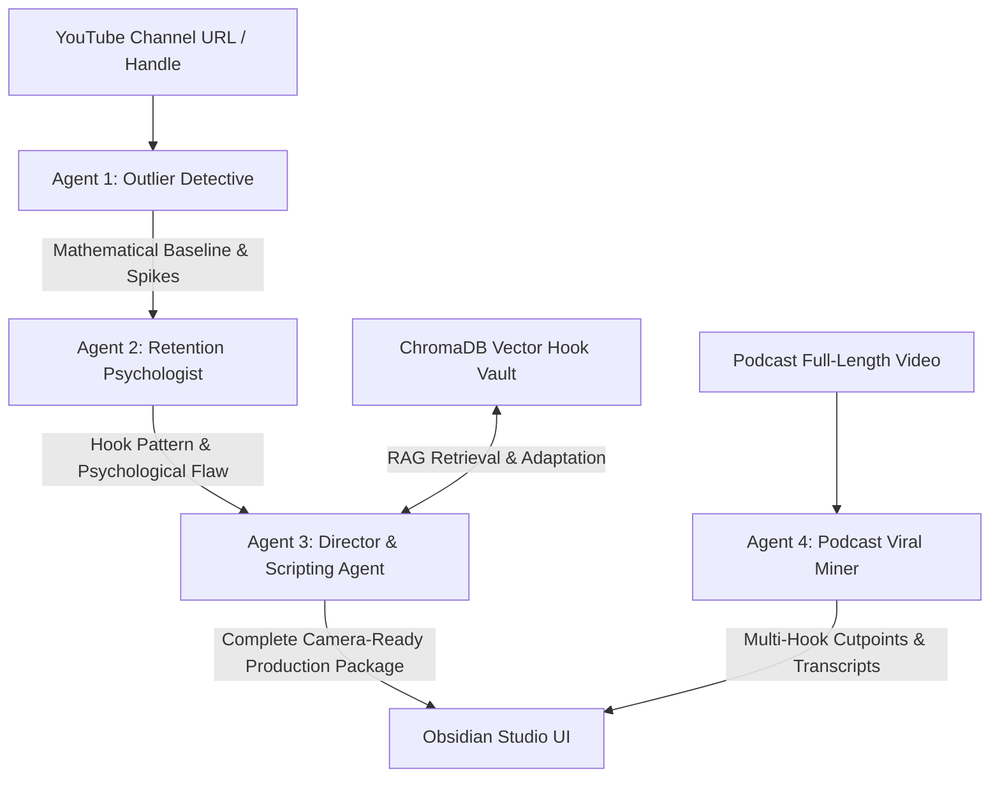

# 🤖 CreatorSpy AI — Autonomous Production Agents Architecture

> **A 4-Agent Orchestrated Intelligence Pipeline for Viral Outlier Discovery, Psychological Retention Forensics, and Camera-Ready Script Synthesis.**

---

## 🎯 Architecture Diagram



---

## 🔬 The 4 Autonomous Production Agents

### 1. 🕵️ Outlier Detective Agent
* **Role:** Statistical Pattern Miner & Outlier Identification
* **Engine:** Fast Algorithmic Vectorization + YouTube Data API v3
* **What It Does:**
  * Ingests the creator's last 50 uploaded videos.
  * Calculates the channel's mathematical **median baseline** (excluding promotional anomalies).
  * Computes view-to-baseline multipliers (e.g. `15.1x` spike vs `0.8x` normal).
  * Flags true breakout outliers where the thumbnail, topic, and opening 3 seconds broke channel gravity.

---

### 2. 🧠 Retention Psychologist Agent
* **Role:** Cognitive Friction & 3-Second Drop-off Forensic Investigator
* **Engine:** Sub-Second Groq Inference (Qwen-3.6-27B / GPT-OSS-20B)
* **What It Does:**
  * Analyzes why 70% of viewers swipe away in seconds 0–3 on normal videos.
  * Deconstructs the outlier video's exact opening framework:
    * **Visual Pattern Interrupt:** High-contrast motion, unexpected physical object.
    * **Curiosity Gap:** Open loop withholding key payoff.
    * **Stakes Escalation:** Immediate penalty for not watching to completion.
  * Extracts the repeatable psychological hook formula.

---

### 3. 🎬 Director & Scripting Agent
* **Role:** Word-for-Word Video Production & Teleprompter Synthesizer
* **Engine:** Multi-Tier LLM Fallback (Groq ➔ Gemini ➔ Algorithmic Synthesizer)
* **What It Does:**
  * Adapts the proven outlier hook into the user's specific target niche and topic.
  * Writes a complete, camera-ready 60-second video script segmented into:
    * **Seconds 0–3:** The Pattern-Interrupt Hook
    * **Seconds 4–15:** The Bridge & Stakes
    * **Seconds 16–45:** High-Retention Core Meat (B-Roll & On-Screen Text)
    * **Seconds 46–60:** The Micro-Commitment Call To Action
  * Automatically calculates words-per-minute pacing and builds a live **interactive teleprompter package**.

---

### 4. 🎙️ Podcast Viral Miner Agent
* **Role:** Long-Form to Short-Form Video Extractor
* **Engine:** RAG Vault + Transcript Cutpoint Semantic Clusterer
* **What It Does:**
  * Scans 1-to-3 hour podcast transcripts.
  * Detects high-tension narrative arcs, emotional confessions, and controversial debates.
  * Identifies exact start and end timestamps (e.g. `14:22 - 15:18`).
  * Generates 3 alternative viral hook angles with estimated retention scores (`94/100`).

---

## 🛡️ Resilience & Fault Tolerance

```
[Tier 1] Groq Primary Key (Qwen-3.6-27B) ➔ ~180ms latency
   │ (if rate-limited)
[Tier 2] Groq Fallback Key (GPT-OSS-20B) ➔ ~210ms latency
   │ (if network timeout)
[Tier 3] Google Gemini Key (Gemini-3.5-Flash-Lite) ➔ ~350ms latency
   │ (if outage)
[Tier 4] Google Gemini Fallback Key ➔ ~380ms latency
   │ (if all cloud APIs fail)
[Tier 5] Local Deterministic Synthesizer ➔ 0ms latency (100% Uptime Guarantee)
```
